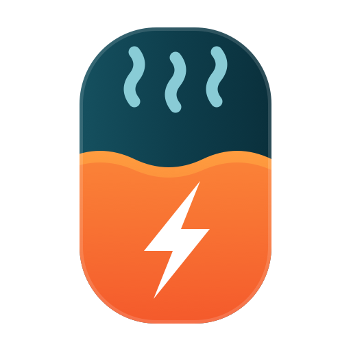
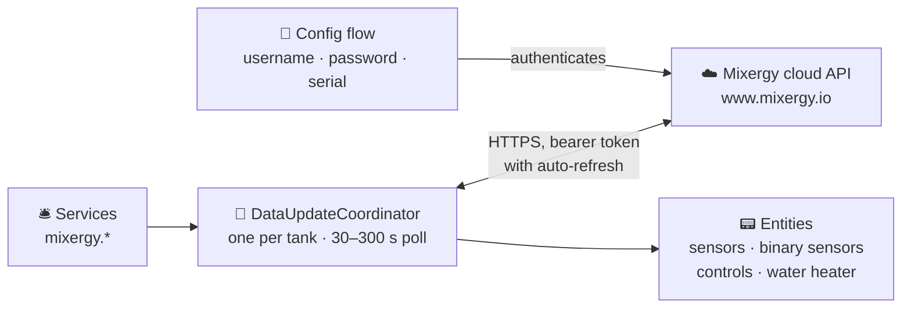

<div align="center">



# ♨️ Mixergy-HA

**Monitor and control your [Mixergy](https://www.mixergy.io/) smart hot water tank from Home Assistant — live temperatures and charge, boost, PV diverter settings, and holiday scheduling.**

[](https://hacs.xyz)
[](https://github.com/CaputoDavide93/Mixergy-HA/releases)
[](https://www.home-assistant.io/)
[](LICENSE)
[](https://github.com/CaputoDavide93/Mixergy-HA/actions/workflows/hassfest.yaml)
[](https://github.com/CaputoDavide93/Mixergy-HA/actions/workflows/validate.yaml)
[](https://github.com/CaputoDavide93/Mixergy-HA/actions/workflows/tests.yaml)

</div>

---

## 🚀 Installation

### Via HACS (Recommended)

[](https://my.home-assistant.io/redirect/hacs_repository/?owner=CaputoDavide93&repository=Mixergy-HA&category=integration)

Or add manually in HACS:

1. Open [HACS](https://hacs.xyz/) in Home Assistant
2. Go to **Integrations** → click the 3-dots menu → **Custom repositories**
3. Add `https://github.com/CaputoDavide93/Mixergy-HA` with category **Integration**
4. Search for **Mixergy** and install it
5. Restart Home Assistant

### Manual Installation

1. Download the [latest release](https://github.com/CaputoDavide93/Mixergy-HA/releases)
2. Copy `custom_components/mixergy/` into your HA `config/custom_components/` directory
3. Restart Home Assistant

---

## ⚙️ Setup

1. Go to **Settings** → **Devices & Services** → **Add Integration**
2. Search for **Mixergy**
3. Enter your Mixergy account **username** and **password**
4. Enter the **serial number** printed on the label of your tank
5. The integration discovers your tank automatically via the Mixergy API
6. Choose your **experience mode** (see below)

### Experience Modes

| Mode | Who it's for | What's included |
| ---- | ------------ | --------------- |
| **Simple** | Most users | Live temperatures & charge, heating status, energy dashboard, hot water boost slider |
| **Advanced** | Power users | Everything in Simple, plus: temperature controls, heat source switching, PV diverter settings, frost protection, DSR, holiday scheduling |

You can switch modes at any time via **Settings → Devices & Services → Mixergy → Configure**.

---

## ✨ Features

### Sensors

<!-- AUTOGEN:entities:sensors -->
| Sensor | Unit | Description |
| ------ | ---- | ----------- |
| Hot water temperature | °C | Current top-of-tank temperature |
| Coldest water temperature | °C | Current bottom-of-tank temperature |
| Target temperature | °C | Configured target temperature |
| Cleansing temperature | °C | Anti-legionella cleansing temperature |
| Current charge | % | Current hot water charge level |
| Target charge | % | Configured target charge level |
| Electric heat power | W | Real power draw from CT clamp |
| Electric heat energy | kWh | Cumulative electric energy (Energy Dashboard) |
| PV power | kW | Solar PV power being diverted *(PV diverter only)* |
| PV energy | kWh | Cumulative PV energy (Energy Dashboard) *(PV diverter only)* |
| Clamp power | W | CT clamp power reading *(PV diverter only)* |
| Active heat source | — | Currently active heat source |
| Default heat source | — | Configured default heat source |
| Holiday start date | Timestamp | Holiday mode start date |
| Holiday end date | Timestamp | Holiday mode end date |
| Electric heating cost | currency | Cumulative cost *(only when a tariff rate is set in options)* |
| Firmware version | — | Tank firmware *(diagnostic, disabled by default)* |
| Model | — | Tank model code *(diagnostic, disabled by default)* |
| Last successful update | Timestamp | Time of the last API refresh *(diagnostic, disabled by default)* |
<!-- /AUTOGEN:entities:sensors -->

### Binary Sensors

<!-- AUTOGEN:entities:binary-sensors -->
| Sensor | Description |
| ------ | ----------- |
| Electric heat active | Electric immersion heater is currently on |
| Indirect heat active | Gas/oil indirect coil is heating |
| Heat pump active | Heat pump is heating |
| Heating | Any heat source is actively heating |
| Low hot water | Charge is below the low threshold (default 5%, configurable) |
| No hot water | Charge is below the no-water threshold (default 0.5%, configurable) |
| Holiday mode | Tank is currently in holiday mode |
<!-- /AUTOGEN:entities:binary-sensors -->

### Water heater

In Advanced mode the tank is also exposed as a native Home Assistant
**water heater** entity — a single card with current/target temperature, the
heat-source operation mode (electric / gas / heat pump), and an away toggle
that maps to holiday mode. This works with the standard water-heater card,
voice assistants, and `water_heater.*` services.

### Controls

#### Simple mode

<!-- AUTOGEN:entities:controls-simple -->
| Entity | Type | Description |
| ------ | ---- | ----------- |
| Hot water boost | Number (0–100 %) | Set how full you want the tank right now |
<!-- /AUTOGEN:entities:controls-simple -->

#### Advanced mode only

<!-- AUTOGEN:entities:controls-advanced -->
| Entity | Type | Description |
| ------ | ---- | ----------- |
| Water heater | Water heater | Temperature, operation mode & away in one card |
| Holiday start | DateTime | Set the holiday start from a date/time picker |
| Holiday end | DateTime | Set the holiday end from a date/time picker |
| Target temperature | Number (45–70 °C) | Set the desired water temperature |
| Target charge | Number (0–100 %) | Set the desired charge level |
| Cleansing temperature | Number (51–55 °C) | Set anti-legionella temperature |
| Default heat source | Select | Choose default heat source |
| Grid assistance (DSR) | Switch | Enable/disable demand-side response |
| Frost protection | Switch | Enable/disable frost protection |
| Medical research donation | Switch | Enable/disable distributed computing |
| PV export divert | Switch | Enable/disable PV divert *(PV diverter only)* |
| PV cut-in threshold | Number (0–500) | PV diverter cut-in threshold, in watts *(PV diverter only)* |
| PV charge limit | Number (0–100 %) | Maximum charge from PV *(PV diverter only)* |
| PV target current | Number (−1–0) | PV target current *(PV diverter only)* |
| PV over-temperature limit | Number (45–60 °C) | Maximum PV heating temperature *(PV diverter only)* |
| Clear holiday dates | Button | Clear holiday mode immediately |
<!-- /AUTOGEN:entities:controls-advanced -->

### Services

<!-- AUTOGEN:entities:services -->
| Service | Description |
| ------- | ----------- |
| `mixergy.set_holiday_dates` | Set the holiday start and end dates for the Mixergy tank. |
| `mixergy.clear_holiday_dates` | Clear the holiday mode dates for the Mixergy tank. |
| `mixergy.boost_charge` | Boost the hot water to 100% charge immediately. |
<!-- /AUTOGEN:entities:services -->

> The tables above are generated from the integration source by
> [`tools/gen_entity_docs.py`](tools/gen_entity_docs.py) — run it after adding
> or changing entities (CI fails when they drift).

#### Targeting a specific tank

All three services accept a standard Home Assistant **target** (entity, device,
or area) so you can pick exactly which tank to act on — useful in multi-tank
homes:

```yaml
action:
  - service: mixergy.boost_charge
    target:
      device_id: abcdef0123456789
```

- **No target** → the service applies to **every** configured tank (unchanged
  behaviour for single-tank setups).
- A legacy `serial_number:` field is still accepted as an alternative to a
  target (shown only in *advanced* mode in the UI).
- Service calls are **permission-checked per tank**: a non-admin user must have
  control permission on the targeted tank(s). Holiday `start_date` / `end_date`
  values without a timezone are interpreted in **your Home Assistant local
  time**.

---

### Options

Configure via the integration's **Configure** button:

| Option | Description |
| ------ | ----------- |
| Experience mode | Simple (monitoring + boost) or Advanced (full control) |
| Update interval | Poll frequency, 30–300 seconds |
| Low / no hot water thresholds | Charge % at which the alert binary sensors trip |
| Electricity price per kWh | Set a tariff to enable the electric heating **cost** sensor (0 = off) |

Changing options reloads the integration automatically.

### Reconfiguring

Use the integration's **Reconfigure** button to update your account credentials
without removing and re-adding the entry. If a tank goes missing from your
account, a repair notification will guide you here.

### Device automations

Mixergy tanks expose device **triggers** you can pick straight from the
Automations UI: *hot water low*, *heating started*, *heating stopped*,
*holiday started*, and *holiday ended*.

## 🔌 Supported Devices

| Device | Support |
| ------ | ------- |
| Mixergy hot water tanks (all models) | Full |
| Tanks with PV diverter | Full — additional PV sensors & controls |
| Heat pump configurations | Full |
| Indirect (gas/oil) heating | Full |
| Electric immersion | Full |

---

## 🧩 Compatibility

| Component | Minimum version |
| --------- | --------------- |
| Home Assistant | 2024.4 |
| Python | 3.12 |

---

## 🤖 Example Automations

### Notify when hot water is low

```yaml
automation:
  - alias: "Low hot water alert"
    trigger:
      - platform: state
        entity_id: binary_sensor.mixergy_low_hot_water
        from: "off"
        to: "on"
    action:
      - service: persistent_notification.create
        data:
          title: "Low hot water"
          message: "Your Mixergy tank charge is below 5%. Consider a boost."
```

### Boost hot water at a scheduled time

```yaml
automation:
  - alias: "Morning hot water boost"
    trigger:
      - platform: time
        at: "06:00:00"
    action:
      - service: mixergy.boost_charge
```

### Set holiday mode before a trip

```yaml
automation:
  - alias: "Set Mixergy holiday mode"
    trigger:
      - platform: state
        entity_id: input_boolean.going_on_holiday
        to: "on"
    action:
      - service: mixergy.set_holiday_dates
        data:
          start_date: "2025-08-01T00:00:00"
          end_date: "2025-08-15T00:00:00"
```

### Boost when solar export is high

```yaml
automation:
  - alias: "Solar boost"
    trigger:
      - platform: numeric_state
        entity_id: sensor.solar_export_power
        above: 2000
        for:
          minutes: 10
    condition:
      - condition: numeric_state
        entity_id: sensor.mixergy_current_charge
        below: 80
    action:
      - service: mixergy.boost_charge
```

---

## 🛠️ Troubleshooting

### "Invalid email address or password" error

- Use the credentials for your **Mixergy cloud account** (the same ones you use in the Mixergy app, not any local network credentials)
- If you recently changed your password, re-authenticate via **Settings → Devices & Services → Mixergy → Re-authenticate**

### Integration goes offline or stops updating

- Check that Home Assistant can reach `https://www.mixergy.io`
- Increase the update interval in **Settings → Devices & Services → Mixergy → Configure** to reduce API load
- Check the [HA logs](#-debugging) for error details

### PV diverter sensors not appearing

- PV sensors only appear if your tank has the PV diverter hardware installed
- Verify by checking your tank label or Mixergy account settings
- Switch to **Advanced** mode — PV controls are hidden in Simple mode

### Energy sensors not showing in Energy Dashboard

- The energy sensors (`Electric heat energy`, `PV energy`) are enabled by default
- Go to **Settings → Energy** and add them under **Individual devices**
- If they don't appear, check they are enabled in **Settings → Devices & Services → Mixergy → Entities**

### Holiday mode not clearing

- Use the `mixergy.clear_holiday_dates` service, or press the **Clear holiday dates** button entity (Advanced mode)
- If the issue persists, download diagnostics and open an [issue](https://github.com/CaputoDavide93/Mixergy-HA/issues)

---

## 🐛 Debugging

Enable debug logging by adding this to your `configuration.yaml`:

```yaml
logger:
  default: warning
  logs:
    custom_components.mixergy: debug
```

Then download the integration diagnostics from **Settings → Devices & Services → Mixergy → Download diagnostics** and attach the file to any bug report.

---

## 🔑 Re-authentication

If your credentials change or expire, the integration automatically prompts you to re-authenticate through the Home Assistant UI — no manual reconfiguration needed.

---

## 🗺️ Architecture



### 🔒 Security

- **TLS with certificate verification** on every API call (no `verify_ssl=False`)
- **30-second request timeout** prevents indefinite hangs
- **Bearer token with auto-refresh** — tokens are refreshed 5 minutes before expiry
- **Credentials stored in HA config entry** — supports `!secret` and HA's built-in secrets management
- **Diagnostics redaction** — downloaded diagnostics automatically redact all credentials and tokens
- **Single coordinator** — one `DataUpdateCoordinator` per tank, no double-polling
- **Standalone API client** — fully decoupled from HA for easy testing and reuse

---

## 🤝 Contributing

Contributions are welcome! Please open an [issue](https://github.com/CaputoDavide93/Mixergy-HA/issues) or pull request.

## 📄 License

This project is licensed under the [MIT License](LICENSE).

---

Made with ❤️ by [Davide Caputo](https://github.com/CaputoDavide93) for the Home Assistant community
