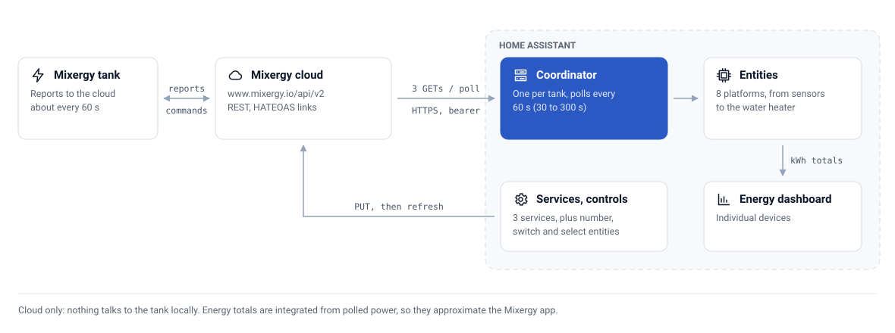

<div align="center">


# ♨️ Mixergy for Home Assistant

**Monitor and control your [Mixergy](https://www.mixergy.io/) smart hot water tank from Home Assistant.**

Live charge and temperatures, one-tap boost, Energy Dashboard support, PV diverter controls, and holiday scheduling.


[](https://hacs.xyz)
[](https://github.com/CaputoDavide93/Mixergy-Home-Assistant/releases)

[](https://github.com/CaputoDavide93/Mixergy-Home-Assistant/actions/workflows/tests.yaml)

</div>

---

## 🚀 Quick Start

1. **Install via HACS** — add `https://github.com/CaputoDavide93/Mixergy-Home-Assistant` as a custom repository, install **Mixergy**, restart Home Assistant.
2. **Add the integration** — **Settings → Devices & Services → Add Integration → Mixergy**, sign in with your Mixergy app credentials and pick your tank.
3. **Choose your mode** — **Simple** for monitoring and boost, **Advanced** for the full control surface. Switch any time from the integration's Configure button.

[](https://my.home-assistant.io/redirect/hacs_repository/?owner=CaputoDavide93&repository=Mixergy-Home-Assistant&category=integration)

> **Quality.** Built against Home Assistant's [Integration Quality Scale](https://developers.home-assistant.io/docs/core/integration-quality-scale/): **46 of the 47 applicable Bronze–Platinum rules are met**, with 7 more not applicable. No tier is claimed — the scale applies to core integrations only, and one Bronze rule (`brands`) is unreachable for any custom integration. The per-rule status, including what is unmet and why, is recorded in [`quality_scale.yaml`](custom_components/mixergy_tank/quality_scale.yaml).

> **Note — the icon shows as a grey placeholder in HACS.** Nothing is wrong with your install: the icon appears correctly everywhere inside Home Assistant itself. This is a [known HACS limitation](https://github.com/hacs/integration/issues/5171) affecting every custom integration published after February 2026, not an issue with this integration. [More detail](docs/troubleshooting.md#why-is-the-icon-missing-in-hacs).

---

## 📚 Documentation

| Guide | What it covers |
| ----- | -------------- |
| [Installation](docs/installation.md) | Requirements, HACS and manual install, updating, uninstalling |
| [Configuration](docs/configuration.md) | The setup flow, Simple vs Advanced modes, every option, reauthentication, multi-tank |
| [Entities](docs/entities.md) | Every sensor, binary sensor, and control — with behaviour details the tables can't carry |
| [Automations](docs/automations.md) | Services, device triggers, and a cookbook of ready-to-use recipes |
| [Energy](docs/energy.md) | Energy Dashboard setup, how energy is measured, tariff-based cost tracking |
| [Troubleshooting](docs/troubleshooting.md) | Symptom-first fixes, debug logging, diagnostics, FAQ |
| [API client](docs/api.md) | Architecture and the standalone Python client for the Mixergy cloud API |

All guides in one place: [docs/README.md](docs/README.md).

---

## ✨ Features

### Sensors

<!-- AUTOGEN:entities:sensors -->
| Sensor | Unit | Description |
| ------ | ---- | ----------- |
| Hot water temperature | °C | Current top-of-tank temperature |
| Coldest water temperature | °C | Current bottom-of-tank temperature |
| Target temperature | °C | Configured target temperature |
| Cleansing temperature | °C | Anti-legionella cleansing temperature |
| Current charge | % | Current hot water charge level |
| Target charge | % | Configured target charge level |
| Electric heat power | W | Real power draw from CT clamp |
| Electric heat energy | kWh | Cumulative electric energy (Energy Dashboard) |
| PV power | kW | Solar PV power being diverted *(PV diverter only)* |
| PV energy | kWh | Cumulative PV energy (Energy Dashboard) *(PV diverter only)* |
| Clamp power | W | CT clamp power reading *(PV diverter only)* |
| Active heat source | — | Currently active heat source |
| Default heat source | — | Configured default heat source |
| Operating reason | — | Why the tank is currently being controlled |
| Holiday start date | Timestamp | Holiday mode start date |
| Holiday end date | Timestamp | Holiday mode end date |
| Electric heating cost | currency | Cumulative cost *(only when a tariff rate is set in options)* |
| Firmware version | — | Tank firmware *(diagnostic, disabled by default)* |
| Model | — | Tank model code *(diagnostic, disabled by default)* |
| Last successful update | Timestamp | Time of the last API refresh *(diagnostic, disabled by default)* |
| Last tank measurement | Timestamp | Time the tank recorded its latest measurement |
| Last cloud receipt | Timestamp | Time the cloud received the latest measurement *(diagnostic, disabled by default)* |
<!-- /AUTOGEN:entities:sensors -->

### Binary Sensors

<!-- AUTOGEN:entities:binary-sensors -->
| Sensor | Description |
| ------ | ----------- |
| Electric heat active | Electric immersion heater is currently on |
| Indirect heat active | Gas/oil indirect coil is heating |
| Heat pump active | Heat pump is heating |
| Heating | Any heat source is actively heating |
| Low hot water | Charge is below the low threshold (default 5%, configurable) |
| No hot water | Charge is below the no-water threshold (default 0.5%, configurable) |
| Holiday mode | Tank is currently in holiday mode |
| Charge target active | A non-zero charge target is currently active |
| Tank connectivity | Latest tank report is fresh |
<!-- /AUTOGEN:entities:binary-sensors -->

### Water heater

In Advanced mode the tank is also exposed as a native Home Assistant
**water heater** entity — a single card with current/target temperature, the
heat-source operation mode (electric / gas / heat pump), and an away toggle
that maps to holiday mode. This works with the standard water-heater card,
voice assistants, and `water_heater.*` services.

### Controls

#### Simple mode

<!-- AUTOGEN:entities:controls-simple -->
| Entity | Type | Description |
| ------ | ---- | ----------- |
| Hot water boost | Number (0–100 %) | Set how full you want the tank right now |
<!-- /AUTOGEN:entities:controls-simple -->

#### Advanced mode only

<!-- AUTOGEN:entities:controls-advanced -->
| Entity | Type | Description |
| ------ | ---- | ----------- |
| Water heater | Water heater | Temperature, operation mode & away in one card |
| Holiday start | DateTime | Set the holiday start from a date/time picker |
| Holiday end | DateTime | Set the holiday end from a date/time picker |
| Target temperature | Number (45–70 °C) | Set the desired water temperature |
| Target charge | Number (0–100 %) | Set the desired charge level |
| Cleansing temperature | Number (51–55 °C) | Set anti-legionella temperature |
| Default heat source | Select | Choose default heat source |
| Grid assistance (DSR) | Switch | Enable/disable demand-side response |
| Frost protection | Switch | Enable/disable frost protection |
| Medical research donation | Switch | Enable/disable distributed computing |
| PV export divert | Switch | Enable/disable PV divert *(PV diverter only)* |
| PV cut-in threshold | Number (0–500) | PV diverter cut-in threshold, in watts *(PV diverter only)* |
| PV charge limit | Number (0–100 %) | Maximum charge from PV *(PV diverter only)* |
| PV target current | Number (−1–0) | PV target current *(PV diverter only)* |
| PV over-temperature limit | Number (45–60 °C) | Maximum PV heating temperature *(PV diverter only)* |
| Clear holiday dates | Button | Clear holiday mode immediately |
<!-- /AUTOGEN:entities:controls-advanced -->

### Services

<!-- AUTOGEN:entities:services -->
| Service | Description |
| ------- | ----------- |
| `mixergy_tank.set_holiday_dates` | Set the holiday start and end dates for the Mixergy tank. |
| `mixergy_tank.clear_holiday_dates` | Clear the holiday mode dates for the Mixergy tank. |
| `mixergy_tank.boost_charge` | Boost the hot water to 100% charge immediately. |
<!-- /AUTOGEN:entities:services -->

> The tables above are generated from the integration source by
> [`tools/gen_entity_docs.py`](tools/gen_entity_docs.py) — run it after adding
> or changing entities (CI fails when they drift).

All three services accept a standard Home Assistant **target** (entity, device,
or area), so you can act on one specific tank in a multi-tank home. No target
means every configured tank. Details, permission rules, and the legacy
`serial_number` field: [Automations guide](docs/automations.md).

### Device automations

Mixergy tanks expose device **triggers** you can pick straight from the
Automations UI: *hot water low*, *heating started*, *heating stopped*,
*holiday started*, and *holiday ended*.

---

## 🗺️ Architecture

<picture>
  <source media="(prefers-color-scheme: dark)" srcset="docs/assets/architecture-dark.svg">
  
</picture>

There is no local path to the tank: every read and write goes through the
Mixergy cloud API. One coordinator per tank polls it (60 s by default,
30–300 s allowed) with three parallel GETs — measurement, settings and
schedule. Services and control entities send a `PUT` and then ask the
coordinator to refresh at once, so a change never waits for the next poll.
The config flow uses the same API to validate credentials and list your tanks.

The full design — the discovery walk, auth lifecycle, error taxonomy, and the
standalone Python client — is documented in the [API guide](docs/api.md).

---

## 📦 Installation

### Via HACS (Recommended)

Use the button in [Quick Start](#-quick-start), or add it manually in HACS:

1. Open [HACS](https://hacs.xyz/) in Home Assistant
2. Go to **Integrations** → click the 3-dots menu → **Custom repositories**
3. Add `https://github.com/CaputoDavide93/Mixergy-Home-Assistant` with category **Integration**
4. Search for **Mixergy** and install it
5. Restart Home Assistant

> **Upgrading from 1.x?** Version 2.0.0 changed the integration domain. The
> old `custom_components/mixergy/` directory must be removed before restarting;
> HACS installs `mixergy_tank/` but does not remove the former domain directory.
> Follow the complete [1.x → 2.x migration](docs/installation.md#upgrading-from-1x-to-2x).

### Manual Installation

1. Download the [latest release](https://github.com/CaputoDavide93/Mixergy-Home-Assistant/releases)
2. Copy `custom_components/mixergy_tank/` into your HA `config/custom_components/` directory
3. Restart Home Assistant

Full details, updating, and uninstalling: [Installation guide](docs/installation.md).

---

## ⚙️ Setup

1. Go to **Settings** → **Devices & Services** → **Add Integration**
2. Search for **Mixergy**
3. Enter your Mixergy account **username** and **password** — the same credentials you use in the Mixergy app
4. Pick your tank from the list (or type the **serial number** printed on the tank label)
5. Choose your **experience mode**

### Experience Modes

| Mode | Who it's for | What's included |
| ---- | ------------ | --------------- |
| **Simple** | Most users | Live temperatures & charge, heating status, energy dashboard, hot water boost slider |
| **Advanced** | Power users | Everything in Simple, plus: temperature controls, heat source switching, PV diverter settings, frost protection, DSR, holiday scheduling, and a native water-heater entity |

You can switch modes at any time via **Settings → Devices & Services → Mixergy → Configure**. The full walkthrough lives in the [Configuration guide](docs/configuration.md).

---

## 🛠️ Options

Configure via the integration's **Configure** button:

| Option | Description |
| ------ | ----------- |
| Experience mode | Simple (monitoring + boost) or Advanced (full control) |
| Update interval | Poll frequency, 30–300 seconds (default 60) |
| Low / no hot water thresholds | Charge % at which the alert binary sensors trip (defaults 5% / 0.5%) |
| Electricity price per kWh | Set a tariff to enable the electric heating **cost** sensor (0 = off) |

Changing options reloads the integration automatically. Credentials can be
updated any time from the **Reconfigure** button, and if they expire the
integration prompts you to re-authenticate — no removal needed.

---

## 🤖 Example Automations

One starter below; the [Automations cookbook](docs/automations.md) has the rest,
including workday-morning and solar-surplus boosts, cheap-tariff
windows, holiday scheduling from a calendar or helpers, and water-heater
service calls.

### Notify when hot water is low

```yaml
automation:
  - alias: "Low hot water alert"
    triggers:
      - trigger: state
        entity_id: binary_sensor.mixergy_tank_<serial>_low_hot_water
        from: "off"
        to: "on"
    actions:
      - action: notify.mobile_app_your_phone
        data:
          title: "Low hot water"
          message: "Tank charge is below the low threshold — consider a boost."
```

> Entity ids follow the pattern `sensor.mixergy_tank_<serial>_…` — replace
> `<serial>` with your tank's serial number, or pick the entity from the UI.

---

## 🔌 Supported Devices

| Device | Support |
| ------ | ------- |
| Mixergy hot water tanks (all models) | Full |
| Tanks with PV diverter | Full — additional PV sensors & controls |
| Heat pump configurations | Full |
| Indirect (gas/oil) heating | Full |
| Electric immersion | Full |

**Requires Home Assistant 2025.8 or newer** and a Mixergy cloud account (the
one you use in the Mixergy app). This is a cloud-polling integration — the
tank has no local API.

English covers the complete UI. German, French, and Italian translations are
included where available, with Home Assistant's English fallback for newer
options and repair messages while locale parity is completed.

---

## 📁 Repo structure

```text
Mixergy-Home-Assistant/
├── custom_components/
│   └── mixergy_tank/           # 🏠 the integration (HACS installs this folder)
│       ├── brand/              # 🎨 packaged icon + logos (HA 2026.3+)
│       └── translations/       # 🌍 de, en, fr, it
├── tests/                      # 🧪 pytest suite (run in CI with coverage)
├── tools/
│   ├── gen_entity_docs.py      # 🤖 regenerates the entity tables (--check in CI)
│   └── gen_diagram.py          # 🗺️ draws the architecture SVGs (--check in CI)
├── docs/                       # 📚 guides (index: docs/README.md)
│   └── assets/                 # 🖼️ architecture SVGs, brand sources, banner, brand-manifest.json
├── .github/                    # 🤖 hassfest, HACS validation, tests; issue templates; Dependabot
├── hacs.json                   # 🏠 HACS metadata
├── pyproject.toml              # ⚙️ pytest, ruff, mypy, coverage config
├── requirements-test.txt       # 🧪 test + lint dependencies
├── llms.txt                    # 🤖 doc map for LLM crawlers
├── CHANGELOG.md
├── SECURITY.md
└── LICENSE
```

---

## ❓ FAQ

| Question | Answer |
| --- | --- |
| [Does it work locally, without the internet?](docs/troubleshooting.md#does-this-work-without-internet-or-locally) | No — it polls the official Mixergy cloud API over TLS |
| [How many tanks can I add?](docs/troubleshooting.md#how-many-tanks-does-it-support) | As many as your account has; each is its own device, and services can target one |
| [Will a Home Assistant update break it?](docs/troubleshooting.md#will-it-break-on-new-home-assistant-versions) | The test suite also runs weekly against the latest Home Assistant release |
| [What data leaves my network?](docs/troubleshooting.md#what-data-leaves-my-network) | Credentials and commands to `mixergy.io` only; see [Security](#-security) |
| [Why don't I see the PV entities?](docs/troubleshooting.md#why-are-the-pv-entities-missing-or-unavailable) | They stay unavailable without PV diverter hardware; controls are Advanced-only |
| [Can I track heating costs?](docs/energy.md#-electric-cost-sensor) | Yes — set a price per kWh in the options and a cost sensor appears |

---

## 🩺 Troubleshooting

The [Troubleshooting guide](docs/troubleshooting.md) walks through every
common symptom — auth errors, missing entities, stale data, holiday mode —
with the checks in order. The two things you'll need for any bug report:

**Debug logging** — add to `configuration.yaml` and restart:

```yaml
logger:
  default: warning
  logs:
    custom_components.mixergy_tank: debug
```

**Diagnostics** — **Settings → Devices & Services → Mixergy → Download
diagnostics**. Credentials, tokens, and the tank serial are redacted
automatically, so the file is safe to attach to an
[issue](https://github.com/CaputoDavide93/Mixergy-Home-Assistant/issues).

---

## 🔒 Security

- **TLS with certificate verification** on every API call (no `verify_ssl=False`)
- **30-second request timeout** prevents indefinite hangs
- **Bearer token with auto-refresh** — tokens are refreshed 5 minutes before expiry
- **Discovered API links are validated** — the client refuses to send the token to any non-HTTPS or non-Mixergy host
- **Credentials stored in HA config entry** — never written to logs or diagnostics
- **Diagnostics redaction** — credentials, tokens, and the tank serial are stripped from diagnostic downloads
- **Per-tank service authorisation** — non-admin users need control permission on the tank they target

To report a vulnerability privately, see [SECURITY.md](SECURITY.md).

---

## 🤝 Contributing

Contributions are welcome! Please open an
[issue](https://github.com/CaputoDavide93/Mixergy-Home-Assistant/issues) or
pull request. The test suite (`pytest tests/`) and the docs generator
(`python tools/gen_entity_docs.py --check`) both run in CI.

---

## 📄 License

This project is licensed under the [MIT License](LICENSE).

---

<p align="center">
  <sub>⭐ If this project helped you, please give it a star! ⭐</sub>
  <br>
  <sub>Made with ❤️ by <a href="https://github.com/CaputoDavide93">Davide Caputo</a></sub>
</p>
