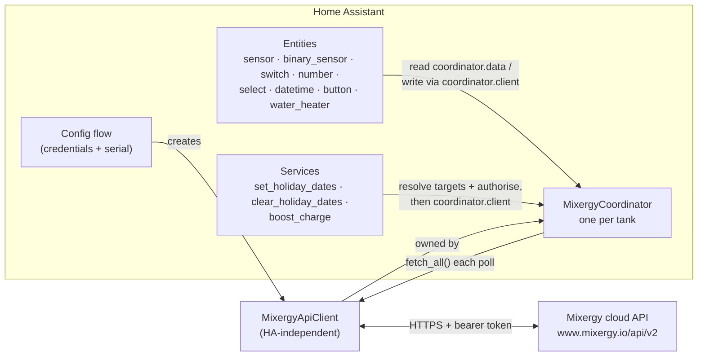

# API Client & Architecture

This page is the developer reference for this integration's internals: the standalone `MixergyApiClient`, the HATEOAS discovery walk and why discovered links are validated, the token lifecycle, the error taxonomy and how the coordinator maps it onto Home Assistant, the polling and write models, and a worked example of driving the client outside Home Assistant entirely. Entity ids in examples use `<serial>` as a placeholder — the integration uses `has_entity_name` with device name `Mixergy Tank (<SERIAL>)`, so real ids look like `sensor.mixergy_tank_mx001234_current_charge`.

## 🧭 Architecture overview

The integration is three layers. The config flow collects credentials and a tank serial, then builds a `MixergyApiClient`. One `MixergyCoordinator` per tank owns that client and polls it. Entities subscribe to the coordinator for state and write through its client; the domain services resolve their targets to coordinators and write through the same path.



`async_setup_entry` (`__init__.py`) wires this up: it builds the client from the entry's username, password and serial number, creates the coordinator, runs `async_config_entry_first_refresh()`, stores the coordinator in `entry.runtime_data`, and forwards the eight platforms. The domain's services are registered separately in `async_setup`, not here, so they exist even when no config entry has loaded — and they are never unregistered, so an automation referencing them keeps validating while entries come and go.

## 🔌 The standalone API client

`MixergyApiClient` (`custom_components/mixergy_tank/api.py`) has no Home Assistant dependency. Its constructor takes an `aiohttp.ClientSession`, a username, a password, and a tank serial number (upper-cased internally). Everything HA-specific — coordinators, config entries, repair issues — lives outside it, so the client works in any asyncio program.

The client holds all per-tank state:

- **Auth state** — the bearer token and its expiry timestamp.
- **Discovered URLs** — the login, tanks, tank, measurement, control, settings, and schedule endpoints found by the HATEOAS walk.
- **Static tank info** — a `TankInfo` (serial, model code, firmware version, PV diverter presence) populated during discovery.
- **Concurrency guards** — an auth lock, a discovery lock, and a schedule write lock (see the write model below).
- **Last-known-good caches** — the most recent successful settings and schedule fetches, used as fall-backs during partial failures.

Every request carries a 30-second total timeout (`REQUEST_TIMEOUT`), so a stalled cloud connection cannot hang a poll indefinitely.

Data comes back as plain dataclasses: `TankData` bundles a `TankInfo`, `TankMeasurement`, `TankSettings`, and `TankSchedule`. Settings use `_as_float` to coerce malformed values to safe finite defaults. Measurement values use `_as_optional_float`, preserving missing, malformed, and non-finite readings as `None` so Home Assistant reports them unavailable instead of manufacturing zeroes. The state payload also becomes a stable `OperatingReason`, and the tank's `recordedTime` / `receivedTime` epoch-millisecond fields become UTC datetimes. The API's `"heatpump"` spelling is normalised to HA-canonical `"heat_pump"` on read and back again on write.

## 🗺️ HATEOAS discovery walk

The client never hard-codes endpoint paths beyond the API root (`https://www.mixergy.io/api/v2`). It discovers everything else by following `_links` in responses — the HATEOAS pattern — and caches what it finds. Two walks exist: an unauthenticated one to find the login endpoint, and an authenticated one to find the tank endpoints.

1. **Login discovery** (`_discover_login_url`): `GET` the root → follow `_links.account` → follow `_links.login`. No token is involved yet.
2. **Tank discovery** (`_discover_tank`): authenticate, `GET` the root → follow `_links.tanks` → find the entry in `_embedded.tankList` whose `serialNumber` matches (case-insensitive) → follow the tank's `_links.self` → cache the tank's `latest_measurement`, `control`, `settings`, and `schedule` links.

Tank discovery also captures static metadata: firmware version from the tank list, model code from the tank detail, and PV diverter presence by parsing the detail's `configuration` JSON (`mixergyPvType != "NO_INVERTER"`). A serial with no match raises `MixergyTankNotFoundError`.

Both walks are guarded against thundering herds: discovery runs under `_discover_lock` with a re-check after acquiring it, so the coordinator's first refresh — which gathers three sub-fetches concurrently — issues exactly one walk instead of three.

### Why are discovered links validated?

Discovered links are attacker-influenceable — a compromised or misconfigured upstream could serve `http://` or off-host URLs, and the client would otherwise send its bearer token wherever the response pointed. `_require_safe_link` therefore accepts only the exact API origin — `https://www.mixergy.io` on the default port, with no embedded credentials — and raises `MixergyConnectionError` for anything else. Redirects are never followed (`allow_redirects=False` on every request), so a redirect cannot replay the token elsewhere either; a permanent redirect on a cached endpoint instead clears the discovery cache so the next poll re-discovers.

The two failure modes it closes:

| Malicious link | Without validation | With validation |
| --- | --- | --- |
| `http://www.mixergy.io/...` | aiohttp's `ssl=True` only applies **when** the URL is HTTPS — an `http://` link silently downgrades and leaks the bearer token over plaintext | Rejected: "not HTTPS … refusing to leak bearer token over plaintext" |
| `https://evil.example/...` | The token is exfiltrated to a third-party host | Rejected: "unexpected host … refusing to send token off the Mixergy origin" |

Every cached link — account, login, tanks, tank self, and the four per-tank endpoints — passes through this check before the client will send a token to it.

## 🔐 Auth lifecycle

Login is a `POST` to the discovered login URL with the username and password. A `201` returns a bearer token plus a TTL; the client refreshes 5 minutes before expiry, serialises refreshes through a lock, retries a mid-poll `401` exactly once after a fresh login, and raises `MixergyAuthError` when the request is still rejected (`401` after the retry, or any `403`) — which triggers HA's reauth flow.

The lifecycle in detail:

1. **Login** (`authenticate`): `POST {username, password}` to the login URL. `401`/`403` means bad credentials → `MixergyAuthError`; any status other than `201` also raises `MixergyAuthError`. A missing or empty token in the response body is treated the same way.
2. **TTL clamping**: the response's `ttl` is used when present, but not trusted blindly. A missing, non-numeric, or non-positive TTL falls back to the default of 3600 s, and the value is clamped to at least twice the refresh buffer (600 s) — otherwise a tiny TTL would make every token instantly "expired", forcing a fresh login per request and risking API throttling.
3. **Proactive refresh**: `_token_valid` treats the token as expired 300 s (`TOKEN_REFRESH_BUFFER`) before its real expiry, so refresh happens ahead of any rejected request.
4. **Single-flight**: `authenticate()` runs under `_auth_lock` and re-checks validity inside the lock — concurrent callers that queued behind an in-flight refresh return immediately instead of logging in again.
5. **One-shot 401 retry** (`_request_with_reauth`): a `401` on any request releases the response, invalidates the token, performs a fresh login, and replays the request once. Only `json=<dict>` bodies are accepted here — a `data=<stream>` body would be exhausted by the first attempt and silently replay empty, so the method raises `TypeError` on that misuse.
6. **Genuine rejection**: if the replayed request still returns `401`, or any request returns `403`, the credentials are genuinely bad or revoked — `MixergyAuthError` is raised. The coordinator maps this to `ConfigEntryAuthFailed`, which opens HA's reauth flow. Without this distinction the integration would loop forever on a retryable error instead of asking you to re-enter credentials.

`invalidate_token()` is public — the config flow's `test_credentials()` uses it to force a clean login rather than validating against a cached token.

## 🚨 Error taxonomy

Four exception types cover the API boundary, and the coordinator maps each onto a distinct Home Assistant behaviour. `MixergyAuthError` is a subclass of `MixergyApiError` — anywhere both are caught, the auth branch must come first, and the entity and service code does exactly that.

| Exception | Raised when | Coordinator mapping (`_async_update_data`) |
| --- | --- | --- |
| `MixergyApiError` (base) | Any other API-layer failure — e.g. a write returning a non-200 status | `UpdateFailed` — retryable; next poll tries again |
| `MixergyAuthError` | Login rejected, or a request still rejected after a fresh login | `ConfigEntryAuthFailed` → HA opens the **reauth flow** |
| `MixergyConnectionError` | Network failure (DNS, TLS, reset, timeout), unexpected status, malformed JSON, or an unsafe/missing HATEOAS link | `UpdateFailed` — retryable |
| `MixergyTankNotFoundError` | The configured serial is not in the account's tank list | **Repair issue** (`tank_not_found_<entry_id>`, severity error) + `ConfigEntryError` — a clear entry state instead of a traceback per poll |

The repair issue is cleared automatically on the next successful fetch, so a tank that reappears (account fixed, hardware re-registered) self-heals without a reload.

Raw `aiohttp` exceptions never escape the client: network-layer failures are normalised to `MixergyConnectionError` inside `_request_with_reauth`, so the coordinator only ever sees typed `MixergyApiError` subclasses and surfaces clean `UpdateFailed` messages instead of untyped tracebacks.

Write paths map errors separately. Entity writes (`MixergyEntity._async_write_command`) and service handlers (`_run_on_targets`) both start the reauth flow on `MixergyAuthError` and wrap everything else in `HomeAssistantError` with a per-tank message.

## 🔁 Polling model

One `DataUpdateCoordinator` runs per tank (per config entry), calling `client.fetch_all()` on each cycle. The interval comes from the entry's options — 30 to 300 seconds, default 60. Entities are `CoordinatorEntity` subclasses with `should_poll` off; every state update flows from the coordinator.

`fetch_all()` gathers `fetch_measurement()`, `fetch_settings()`, and `fetch_schedule()` concurrently with `asyncio.gather(..., return_exceptions=True)`, then applies a deliberate asymmetry:

- **Measurement is mandatory.** Tank charge and temperature are the primary signal — if that sub-fetch failed, the whole poll fails and the coordinator marks the update as failed.
- **Settings and schedule fall back to last-known-good.** These change slowly; a transient failure (a rate-limited endpoint, a brief upstream hiccup) logs a warning and reuses the previous successful fetch rather than blanking every entity to `unavailable` for a cycle. Only when no prior good value exists — typically the very first refresh — does the failure propagate.

On success the coordinator stamps `data.last_update_time` for the API-poll diagnostic, then compares the tank's received (or recorded) timestamp with the current time. A report is fresh for at least five minutes, extended to three configured poll intervals when polling is slower. The connectivity binary sensor exposes that result, while energy and cost accumulators skip stale reports. If older tank firmware omits both timestamps, freshness remains unknown and the pre-2.2 accumulation behaviour is preserved. The coordinator also clears any outstanding tank-not-found repair issue.

## ✍️ Write model

Writes go through the client's `set_*` methods, each of which clamps its input to the API's accepted range before sending. Simple writes are a single `PUT` to the control or settings endpoint; schedule writes are read-modify-write and are serialised under a dedicated lock to prevent lost updates.

| Method | Range clamped to | Endpoint |
| --- | --- | --- |
| `set_target_charge` | 0–100 % | control |
| `set_target_temperature` | 45–70 °C | settings |
| `set_cleansing_temperature` | 51–55 °C | settings |
| `set_pv_cut_in_threshold` | 0–500 W | settings |
| `set_pv_charge_limit` | 0–100 % | settings |
| `set_pv_target_current` | −1–0 | settings |
| `set_pv_over_temperature` | 45–60 °C | settings |
| `set_dsr_enabled` / `set_frost_protection_enabled` / `set_distributed_computing_enabled` / `set_divert_exported_enabled` | boolean | settings |
| `set_holiday_dates` / `clear_holiday_dates` / `set_default_heat_source` | — | schedule (read-modify-write) |

After any entity write, `_async_write_command` requests a coordinator refresh so state converges quickly instead of waiting out the poll interval. The domain services do the same per targeted tank.

### What lost-update race does the schedule lock prevent?

The schedule endpoint has no field-level PATCH — `set_holiday_dates`, `clear_holiday_dates`, and `set_default_heat_source` each fetch the whole schedule object, mutate one field, and `PUT` the whole object back. Two near-simultaneous callers — a UI button plus an automation, or two automations firing on overlapping triggers — could read the same starting point, mutate independent fields, and overwrite each other, so only one mutation survives.

`_mutate_schedule` owns the entire GET-mutate-PUT sequence under `_schedule_write_lock`, making each schedule write atomic from the integration's perspective and structurally preventing a new writer from forgetting the lock. The second caller's read happens after the first caller's write has landed, so both mutations survive. Mutations operate on a shallow copy, so a rejected PUT cannot alter the last-known-good cached schedule.

Home Assistant adds a second layer: every write-capable platform (`button`, `datetime`, `number`, `select`, `switch`, `water_heater`) declares `PARALLEL_UPDATES = 1`, so HA serialises entity service calls within each platform. The read-only platforms (`sensor`, `binary_sensor`) declare `PARALLEL_UPDATES = 0` — unlimited, as they never write and are coordinator-driven anyway.

Naive datetimes passed to `set_holiday_dates` are interpreted as UTC, matching `fetch_schedule`'s UTC read; the HA service layer converts your local wall-clock input to an aware datetime first, so holiday windows land where you meant them.

## 🩹 Stale-link self-healing

A `404` or `410` on a discovered URL means the cached link has gone stale — the cloud API rotated its endpoints or a firmware update changed the URL shape. `_request_with_reauth` responds by clearing the four cached per-tank links (measurement, control, settings, schedule) and logging a warning; the next call re-runs the discovery walk automatically.

Without this guard the coordinator would hit the dead URL on every poll forever, and the only remedy would be reloading the integration.

One subtlety: `fetch_all()` gathers three sub-fetches concurrently, so a `404` handled mid-flight can null the cache while a sibling sub-fetch — already past discovery's fast path — is about to read it. `_require_url` covers that window: it raises a typed `MixergyConnectionError` ("no longer cached; the next request will re-discover") instead of passing `None` to aiohttp, and the coordinator retries cleanly on the next poll, which re-discovers.

## 🐍 Using the client outside Home Assistant

The client needs nothing from HA — an `aiohttp.ClientSession` and your Mixergy credentials are enough. Clone [github.com/CaputoDavide93/Mixergy-Home-Assistant](https://github.com/CaputoDavide93/Mixergy-Home-Assistant) and import from `custom_components/mixergy_tank/api.py` (the module imports only `aiohttp` and the standard library).

```python
import asyncio

import aiohttp

from custom_components.mixergy_tank.api import (
    MixergyApiClient,
    MixergyAuthError,
)


async def main() -> None:
    async with aiohttp.ClientSession() as session:
        client = MixergyApiClient(
            session=session,
            username="you@example.com",
            password="your-password",
            serial_number="<serial>",
        )

        try:
            await client.test_credentials()
        except MixergyAuthError:
            print("Bad username or password")
            return

        # Every tank on the account — [{"serial": ..., "firmware": ...}, ...]
        print(await client.async_list_tanks())

        # Full data bundle: info + measurement + settings + schedule
        data = await client.fetch_all()
        print(f"Charge: {data.measurement.charge} %")
        print(f"Hot water: {data.measurement.hot_water_temperature} °C")
        print(f"Target temperature: {data.settings.target_temperature} °C")
        print(f"Model: {data.info.model_code}, fw {data.info.firmware_version}")

        # Writes — inputs are clamped to the API's accepted ranges
        await client.set_target_charge(100)      # boost to full
        await client.set_target_temperature(55)  # 45-70 °C


asyncio.run(main())
```

Individual fetches (`fetch_measurement()`, `fetch_settings()`, `fetch_schedule()`) work too; `fetch_all()` is what the coordinator uses. Two validation helpers round out the surface: `test_credentials()` forces a clean login (used by the config, reauth, and reconfigure flows) and `test_connection()` forces a fresh tank-discovery walk, raising `MixergyTankNotFoundError` when the serial is not on the account. Authentication, discovery, token refresh, and the 401 retry all happen implicitly on first use — you never call `authenticate()` yourself unless you want to fail fast.

## 🔗 See also

- [Installation](installation.md)
- [Configuration](configuration.md)
- [Entities](entities.md)
- [Automations](automations.md)
- [Energy](energy.md)
- [Troubleshooting](troubleshooting.md)
- [README](../README.md)
